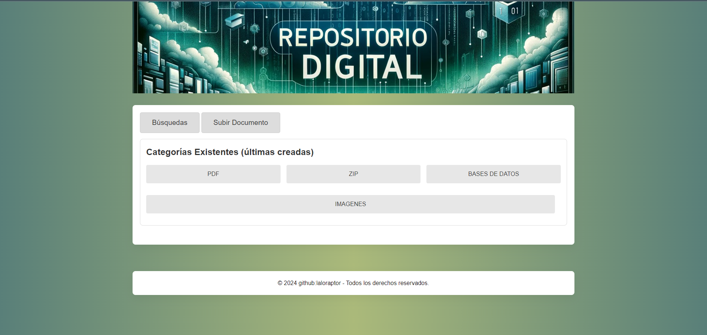
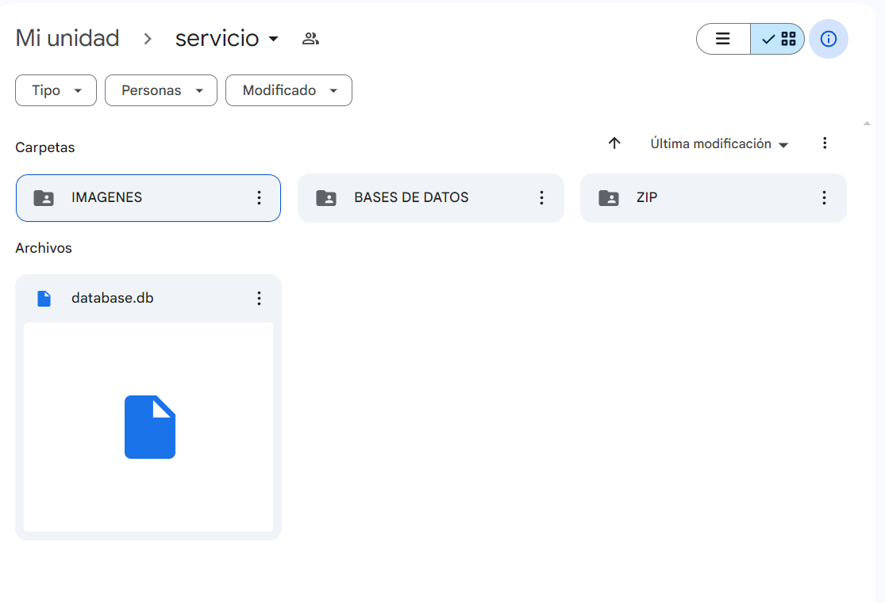
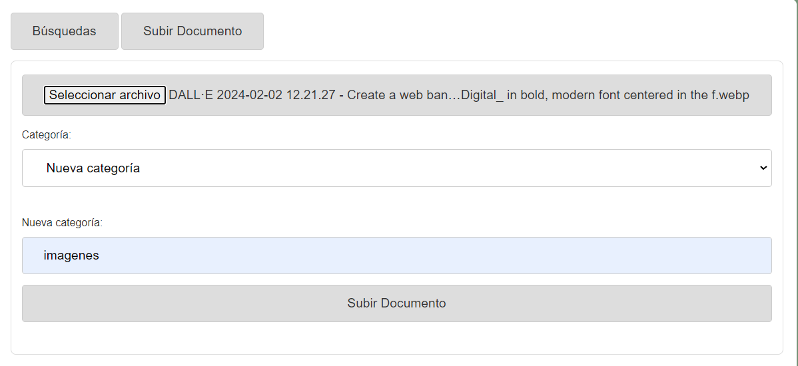
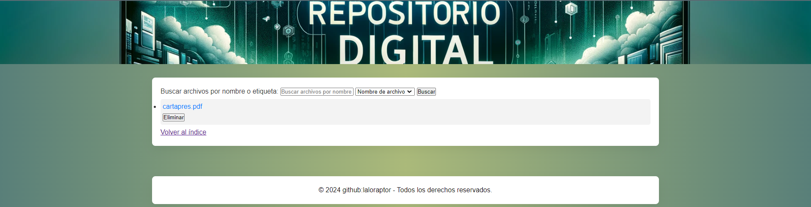
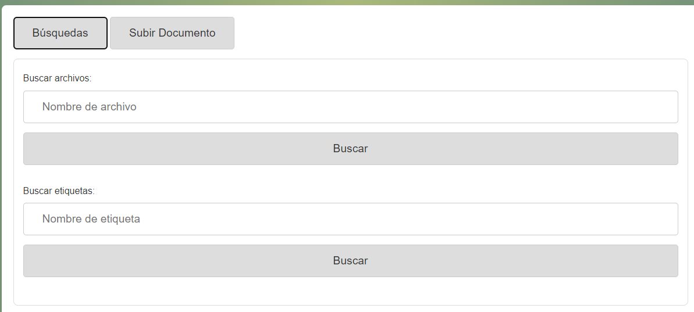

# <h1 align="center">**`Document Management Platform with Google Drive`**</h1>
* ** **`Eduardo Pérez Chavarría` _(Data Engineer, Data Analyst, Data Scientist)_** [](https://www.linkedin.com/in/eduardo-perez-chavarria/)

Consulta aquí el [README.md](README_ESP.md) en español

Here is presented the project of a digital repository that allows the efficient management of stored documents using Google Drive and providing a web interface for uploading, downloading, searching and deleting documents. It is designed to facilitate the organization of files using custom tags, also offering advanced search by name or tag and duplicate prevention. This is the core product of a larger ongoing project, which seeks to integrate this platform into a login system with two-factor authentication and differential permissions for users and administrators. 

I invite you to take a look at how it works in this video https://youtu.be/nWmto4z06eY




## Technology Stack
See in detail [here](stack_tecnologico.md)
- Backend: Python 3.9, Flask, SQLite3
- Authentication and Authorization: Google OAuth2
- Google Drive API: Google Drive API v3
- Frontend: HTML5, CSS3, JavaScript
- Development Tools: Git, GitHub
- Core Dependencies: google-auth, google-api-python-client, google-auth-oauthlib, google-auth-httplib2
- Other Components: MediaFileUpload from googleapiclient.http, Flask extensions.


## Detailed Functionalities

### Document Upload

- Folder Selection:** Users can select existing folders in Google Drive or create new tags when uploading documents, facilitating organization from the start.


- Duplicate Prevention:** Before creating a new tag (folder), the application checks if one with the same name already exists, thus avoiding the creation of duplicates.

### Downloading Documents

- Direct Access:** Documents can be downloaded directly from the web interface, providing a secure download link that connects to Google Drive.


### Advanced Search

- Filtering by Name or Tag:** Users can search for documents using names or tags, allowing for fast and efficient retrieval of needed files.


### Tag Management

- **Creation and Reuse:** When creating a new tag for a document, if the tag already exists in Google Drive, the application reuses the existing one, keeping the organization without redundancies.

### Document and Folder Deletion.

- When a document is deleted through the web interface, the application also checks if the folder (tag) was left empty. If so, it deletes the folder from Google Drive to maintain a clean and organized environment.


### Friendly Interface

- Intuitive Design:** The interface is designed to be intuitive and easy to use, allowing users to perform all necessary operations without hassle and without the need to interact directly with Google Drive.

### Cautions and Care

- Error Handling:** The application carefully manages errors related to the Google Drive API, ensuring that users are informed of any problems that occur during uploading, downloading or deleting documents.

- **Data Security:** Uses Google OAuth2 service credentials to authenticate and authorize operations in Google Drive, maintaining the security of documents and user information.

## Installation

To get this project up and running, follow the steps below:

1. Clone the repository:

    ````bash
    git clone https://github.com/tu-usuario/tu-repositorio.git
    ```

2. Install the necessary dependencies by running:

    ````bash
    pip install -r requirements.txt
    ```

3. Configure the Google Drive API credentials by placing your JSON credentials file in the root directory and updating the path in `SERVICE_ACCOUNT_FILE` within the code.

4. Before running the application, make sure to create the necessary database by running `create_base.py`. This is important for the file searching and logging functionality. You can run it with the following command:

    ````bash
    python create_base.py
    ```

## Usage

To start the application:

1. Run the Flask server with the following command:

    ````bash
    python app.py
    ```

2. Open a browser and go to http://localhost:5000 to access the document management platform.

### Upload a Document

- Click on "Upload Document".
- Select the document you wish to upload and assign an existing tag or create a new one.
- Click "Upload Document" to complete the process.

### Search Documents

- Use the "Search" option to find documents by name or tag.
- The search results will display all documents that match your query.

## Database

The application uses a database to search and record files. Before using the platform, run `create_base.py` to create the necessary database. In the future, fields for version control and other additional functionality can be integrated.