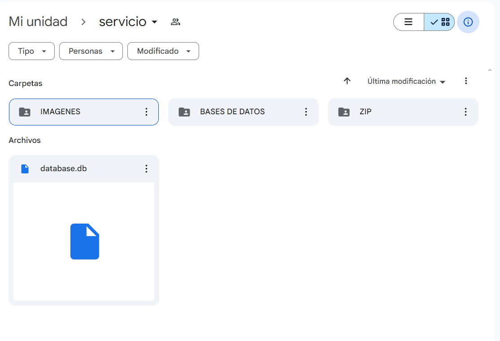

# <h1 align="center">**`Plataforma de Gestión de Documentos con Google Drive`**</h1>
* **`Eduardo Pérez Chavarría` _(Data Engineer, Data Analyst, Data Scientist)_**   [](https://www.linkedin.com/in/eduardo-perez-chavarria/)

Aquí se presenta el proyecto de un repositorio digital que permite la gestión eficiente de documentos almacenados usando para ello Google Drive y proporcionando una interfaz web para subir, descargar, buscar y eliminar documentos. Está diseñada para facilitar la organización de archivos mediante etiquetas personalizadas, ofreciendo también búsqueda avanzada por nombre o etiqueta y prevención de duplicados. Se trata del producto central de un proyecto en curso más amplio, que busca integrar esta plataforma a un sistema de login con autentificación de dos factores y permisos diferenciales para usuarios y administradores. 

Te invito a mirar el funcionamiento en este video https://youtu.be/nWmto4z06eY


## Stack Tecnológico
Ver en detalle [aqui](stack_tecnologico.md)
- Backend: Python 3.9, Flask, SQLite3
- Autenticación y Autorización: Google OAuth2
- Google Drive API: Google Drive API v3
- Frontend: HTML5, CSS3, JavaScript
- Herramientas de Desarrollo: Git, GitHub
- Dependencias Principales: google-auth, google-api-python-client, google-auth-oauthlib, google-auth-httplib2
- Otros Componentes: MediaFileUpload de googleapiclient.http, Flask extensions


## Funcionalidades Detalladas

### Subida de Documentos

- **Selección de Carpetas:** Los usuarios pueden seleccionar carpetas existentes en Google Drive o crear nuevas etiquetas al momento de subir documentos, facilitando la organización desde el inicio.


- **Prevención de Duplicados:** Antes de crear una nueva etiqueta (carpeta), la aplicación verifica si ya existe una con el mismo nombre, evitando así la creación de duplicados.

### Descarga de Documentos

- **Acceso Directo:** Los documentos pueden ser descargados directamente desde la interfaz web, proporcionando un enlace de descarga segura que conecta con Google Drive.


### Búsqueda Avanzada

- **Filtrado por Nombre o Etiqueta:** Los usuarios pueden buscar documentos utilizando nombres o etiquetas, lo que permite una recuperación rápida y eficiente de los archivos necesarios.


### Gestión de Etiquetas

- **Creación y Reutilización:** Al crear una nueva etiqueta para un documento, si la etiqueta ya existe en Google Drive, la aplicación reutiliza la existente, manteniendo la organización sin redundancias.

### Eliminación de Documentos y Carpetas

- **Eliminación Segura:** Cuando un documento es eliminado a través de la interfaz web, la aplicación también verifica si la carpeta (etiqueta) quedó vacía. Si es así, elimina la carpeta de Google Drive para mantener un entorno limpio y organizado.


### Interfaz Amigable

- **Diseño Intuitivo:** La interfaz es diseñada para ser intuitiva y fácil de usar, permitiendo a los usuarios realizar todas las operaciones necesarias sin complicaciones y sin necesidad de interactuar directamente con Google Drive.

### Precauciones y Cuidados

- **Manejo de Errores:** La aplicación gestiona cuidadosamente los errores relacionados con la API de Google Drive, asegurando que los usuarios sean informados de cualquier problema que ocurra durante la subida, descarga o eliminación de documentos.

- **Seguridad de Datos:** Utiliza credenciales de servicio de Google OAuth2 para autenticar y autorizar las operaciones en Google Drive, manteniendo la seguridad de los documentos y de la información del usuario.

## Instalación

Para poner en marcha este proyecto, sigue los siguientes pasos:

1. Clona el repositorio:

    ```bash
    git clone https://github.com/tu-usuario/tu-repositorio.git
    ```

2. Instala las dependencias necesarias ejecutando:

    ```bash
    pip install -r requirements.txt
    ```

3. Configura las credenciales de Google Drive API colocando tu archivo de credenciales JSON en el directorio raíz y actualizando la ruta en `SERVICE_ACCOUNT_FILE` dentro del código.

4. Antes de ejecutar la aplicación, asegúrate de crear la base de datos necesaria ejecutando `crear_base.py`. Esto es importante para la funcionalidad de búsqueda y registro de archivos. Puedes ejecutarlo con el siguiente comando:

    ```bash
    python crear_base.py
    ```

## Uso

Para iniciar la aplicación:

1. Ejecuta el servidor Flask con el siguiente comando:

    ```bash
    python app.py
    ```

2. Abre un navegador y ve a http://localhost:5000 para acceder a la plataforma de gestión de documentos.

### Subir un Documento

- Haz clic en "Subir Documento".
- Selecciona el documento que deseas subir y asigna una etiqueta existente o crea una nueva.
- Haz clic en "Subir Documento" para finalizar el proceso.

### Buscar Documentos

- Utiliza la opción de "Búsqueda" para encontrar documentos por nombre o etiqueta.
- Los resultados de la búsqueda mostrarán todos los documentos que coincidan con tu consulta.

## Base de Datos

La aplicación utiliza una base de datos para la búsqueda y el registro de archivos. Antes de usar la plataforma, ejecuta `crear_base.py` para crear la base necesaria. En el futuro, se pueden integrar campos para el control de versiones y otras funcionalidades adicionales.